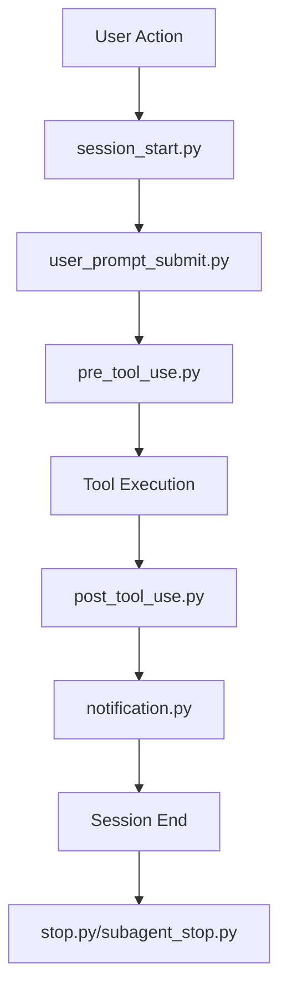

# 🎣 .claude/hooks System Comprehensive Guide

## 📋 Overview

The `.claude/hooks` system is a powerful framework that enhances Claude Code with intelligent file system protection, documentation management, session tracking, and workflow automation. This guide provides complete documentation for understanding, configuring, and extending the hook system.

---

## 🏗️ Hook System Architecture

### 📁 Directory Structure

```
.claude/hooks/
├── pre_tool_use.py              # Pre-execution validation and protection
├── post_tool_use.py             # Post-execution cleanup and indexing
├── session_start.py             # Session initialization and context loading
├── user_prompt_submit.py        # Prompt preprocessing and enhancement
├── stop.py                      # Session cleanup
├── subagent_stop.py            # Sub-agent session cleanup
├── pre_compact.py              # Context compaction preparation
├── notification.py             # Notification system
├── migrate_data.py             # Data migration utilities
├── pytest.ini                 # Testing configuration
├── utils/                      # Utility modules
│   ├── session_tracker.py     # Session management
│   ├── docs_indexer.py        # Documentation indexing
│   ├── env_loader.py          # Environment variable loading
│   └── file_permissions.py    # File system protection
├── config/                     # Hook configuration
│   ├── allowed_patterns.json  # File pattern permissions
│   └── hook_settings.json     # Hook behavior settings
├── core/                       # Core hook utilities
├── data/                       # Hook data storage
├── logs/                       # Hook execution logs
└── tests/                      # Hook system tests
```

### 🔄 Hook Execution Lifecycle



---

## 🛡️ Core Hook Files

### 🔒 pre_tool_use.py - File System Protection

**Purpose**: Validates and protects file system operations before execution.

#### **Key Features**
- **File System Protection**: Prevents unauthorized file creation/modification
- **Path Validation**: Ensures files are created in appropriate directories
- **Documentation Enforcement**: Enforces documentation for important files
- **Session Tracking**: Manages 2-hour work sessions to prevent workflow disruption

#### **Configuration Analysis**
```python
# Root directory restrictions
ALLOWED_ROOT_FILES = [
    'README.md', 'CHANGELOG.md', 'TEST-CHANGELOG.md',
    'CLAUDE.md', 'CLAUDE.local.md'
]

# Valid test paths
VALID_TEST_PATHS = [
    'agenthub_mcp_main/src/tests/',
    'agenthub-frontend/src/tests/',
    'tests/'
]

# Protected patterns
PROTECTED_PATTERNS = [
    '.env*',           # Environment files
    '*.key',           # Key files
    '*.pem',           # Certificate files
    'config/prod/*'    # Production configs
]
```

#### **Protection Mechanisms**

1. **Root Directory Protection**
   ```python
   def validate_root_creation(file_path):
       """Prevent unauthorized root file creation."""
       if is_root_file(file_path) and not is_allowed_root_file(file_path):
           raise FileProtectionError(
               f"Cannot create {file_path} in root directory. "
               f"Only allowed: {ALLOWED_ROOT_FILES}"
           )
   ```

2. **Documentation Enforcement**
   ```python
   def check_documentation_requirement(file_path):
       """Enforce documentation for important files."""
       doc_path = f"ai_docs/_absolute_docs/{file_path}.md"
       if exists(doc_path) and not in_active_session(file_path):
           prompt_for_documentation_update(doc_path)
   ```

3. **Test File Validation**
   ```python
   def validate_test_file_location(file_path):
       """Ensure test files are in correct directories."""
       if is_test_file(file_path):
           if not any(file_path.startswith(path) for path in VALID_TEST_PATHS):
               raise TestLocationError(f"Test file must be in: {VALID_TEST_PATHS}")
   ```

### 📊 post_tool_use.py - Cleanup and Indexing

**Purpose**: Performs cleanup, documentation indexing, and system maintenance after tool execution.

#### **Key Features**
- **Documentation Indexing**: Updates `ai_docs/index.json` automatically
- **Obsolete File Management**: Moves docs to `_obsolete_docs` when source files deleted
- **File System Cleanup**: Removes temporary files and maintains system hygiene
- **Audit Logging**: Records all file system changes for compliance

#### **Documentation Indexing Process**
```python
def update_documentation_index():
    """Update ai_docs/index.json with current documentation state."""

    index_data = {
        "generated_at": datetime.now().isoformat(),
        "total_files": 0,
        "directories": {},
        "file_hashes": {},
        "last_modified": {}
    }

    # Scan all documentation directories
    for root, dirs, files in os.walk("ai_docs"):
        for file in files:
            if file.endswith('.md'):
                file_path = os.path.join(root, file)

                # Calculate MD5 hash for change detection
                with open(file_path, 'rb') as f:
                    file_hash = hashlib.md5(f.read()).hexdigest()

                # Get file metadata
                stat = os.stat(file_path)

                index_data["file_hashes"][file_path] = file_hash
                index_data["last_modified"][file_path] = stat.st_mtime
                index_data["total_files"] += 1

    # Write index.json
    with open("ai_docs/index.json", 'w') as f:
        json.dump(index_data, f, indent=2)
```

#### **Obsolete File Management**
```python
def manage_obsolete_documentation():
    """Move documentation for deleted source files to _obsolete_docs."""

    absolute_docs_path = "ai_docs/_absolute_docs"
    obsolete_docs_path = "ai_docs/_obsolete_docs"

    for root, dirs, files in os.walk(absolute_docs_path):
        for file in files:
            if file.endswith('.md'):
                doc_path = os.path.join(root, file)

                # Derive source file path from documentation path
                source_path = derive_source_path(doc_path)

                if not os.path.exists(source_path):
                    # Source file deleted, move doc to obsolete
                    obsolete_path = doc_path.replace(absolute_docs_path, obsolete_docs_path)
                    os.makedirs(os.path.dirname(obsolete_path), exist_ok=True)
                    shutil.move(doc_path, obsolete_path)

                    log_obsolete_move(doc_path, obsolete_path, source_path)
```

### 🚀 session_start.py - Session Initialization

**Purpose**: Initializes Claude Code sessions with proper context, environment loading, and system preparation.

#### **Key Features**
- **Environment Loading**: Loads environment variables from `.env.claude`
- **Context Initialization**: Sets up project and user contexts
- **System Health Checks**: Verifies all systems are operational
- **Session Tracking**: Initializes session tracking for work continuity

#### **Session Initialization Process**
```python
def initialize_session():
    """Initialize Claude Code session with full context."""

    # 1. Load environment variables
    load_environment_variables()

    # 2. Initialize logging
    setup_session_logging()

    # 3. Health checks
    perform_system_health_checks()

    # 4. Load project context
    load_project_context()

    # 5. Initialize session tracking
    initialize_session_tracking()

    # 6. Prepare AI context
    prepare_ai_context()

    # 7. Status line initialization
    initialize_status_line()
```

#### **Environment Variable Loading**
```python
def load_environment_variables():
    """Load environment variables from .env.claude."""

    env_files = ['.env.claude', '.env.local', '.env']

    for env_file in env_files:
        if os.path.exists(env_file):
            load_dotenv(env_file)
            log_env_loading(env_file)

    # Validate required variables
    required_vars = [
        'AI_DOCS', 'AI_DATA', 'PROJECT_ROOT'
    ]

    missing_vars = [var for var in required_vars if not os.getenv(var)]
    if missing_vars:
        raise EnvironmentError(f"Missing required environment variables: {missing_vars}")
```

### 📝 user_prompt_submit.py - Prompt Enhancement

**Purpose**: Preprocesses and enhances user prompts with additional context, project information, and intelligent suggestions.

#### **Key Features**
- **Context Injection**: Adds relevant project context to prompts
- **Intent Recognition**: Analyzes prompt intent for better responses
- **Resource Suggestions**: Suggests relevant documentation and resources
- **Command Enhancement**: Enhances prompts with available commands

#### **Prompt Enhancement Process**
```python
def enhance_user_prompt(original_prompt):
    """Enhance user prompt with context and suggestions."""

    # 1. Analyze prompt intent
    intent = analyze_prompt_intent(original_prompt)

    # 2. Gather relevant context
    context = gather_relevant_context(intent)

    # 3. Find related documentation
    related_docs = find_related_documentation(original_prompt)

    # 4. Suggest commands
    suggested_commands = suggest_relevant_commands(intent)

    # 5. Build enhanced prompt
    enhanced_prompt = build_enhanced_prompt(
        original_prompt, context, related_docs, suggested_commands
    )

    return enhanced_prompt
```

---

## 🛠️ Utility Modules

### 📊 utils/session_tracker.py - Session Management

**Purpose**: Manages 2-hour work sessions to prevent workflow disruption while maintaining documentation requirements.

#### **Session Tracking Logic**
```python
class SessionTracker:
    """Manages file access sessions for documentation enforcement."""

    def __init__(self):
        self.session_file = ".claude/data/sessions.json"
        self.session_duration = 7200  # 2 hours

    def start_session(self, file_path):
        """Start a new session for file access."""
        sessions = self.load_sessions()
        sessions[file_path] = {
            "start_time": time.time(),
            "last_access": time.time(),
            "access_count": 1
        }
        self.save_sessions(sessions)

    def is_in_session(self, file_path):
        """Check if file is in active session."""
        sessions = self.load_sessions()

        if file_path not in sessions:
            return False

        session = sessions[file_path]
        elapsed = time.time() - session["start_time"]

        return elapsed < self.session_duration

    def extend_session(self, file_path):
        """Extend session with new access."""
        sessions = self.load_sessions()
        if file_path in sessions:
            sessions[file_path]["last_access"] = time.time()
            sessions[file_path]["access_count"] += 1
            self.save_sessions(sessions)
```

### 📚 utils/docs_indexer.py - Documentation Indexing

**Purpose**: Maintains comprehensive documentation index for fast AI access and change tracking.

#### **Indexing Process**
```python
class DocumentationIndexer:
    """Manages documentation indexing and metadata."""

    def __init__(self):
        self.index_file = "ai_docs/index.json"
        self.docs_root = "ai_docs"

    def build_index(self):
        """Build complete documentation index."""
        index = {
            "metadata": {
                "generated_at": datetime.now().isoformat(),
                "version": "2.0",
                "total_files": 0,
                "total_size": 0
            },
            "directories": {},
            "files": {},
            "tags": {},
            "links": {}
        }

        # Scan all documentation
        for root, dirs, files in os.walk(self.docs_root):
            rel_root = os.path.relpath(root, self.docs_root)

            # Index directory
            index["directories"][rel_root] = {
                "file_count": len([f for f in files if f.endswith('.md')]),
                "subdirs": dirs.copy(),
                "last_modified": os.path.getmtime(root)
            }

            # Index files
            for file in files:
                if file.endswith('.md'):
                    file_path = os.path.join(root, file)
                    file_info = self.analyze_file(file_path)
                    index["files"][file_path] = file_info
                    index["metadata"]["total_files"] += 1
                    index["metadata"]["total_size"] += file_info["size"]

        return index

    def analyze_file(self, file_path):
        """Analyze documentation file for metadata."""
        with open(file_path, 'r', encoding='utf-8') as f:
            content = f.read()

        # Extract metadata
        stat = os.stat(file_path)

        return {
            "size": stat.st_size,
            "last_modified": stat.st_mtime,
            "md5_hash": hashlib.md5(content.encode()).hexdigest(),
            "line_count": len(content.splitlines()),
            "word_count": len(content.split()),
            "headers": self.extract_headers(content),
            "tags": self.extract_tags(content),
            "links": self.extract_links(content)
        }
```

### 🌍 utils/env_loader.py - Environment Management

**Purpose**: Securely loads and manages environment variables with validation and error handling.

```python
class EnvironmentLoader:
    """Secure environment variable loading and management."""

    def __init__(self):
        self.required_vars = [
            'AI_DOCS', 'AI_DATA', 'PROJECT_ROOT'
        ]
        self.optional_vars = {
            'LOG_LEVEL': 'INFO',
            'SESSION_TIMEOUT': '7200',
            'AUTO_INDEX': 'true'
        }

    def load_environment(self):
        """Load environment variables from multiple sources."""
        # Load from files in order of preference
        env_files = [
            '.env.claude',      # Claude-specific config
            '.env.local',       # Local overrides
            '.env'              # Project defaults
        ]

        for env_file in env_files:
            if os.path.exists(env_file):
                self.load_env_file(env_file)

        # Set defaults for optional variables
        for var, default in self.optional_vars.items():
            if not os.getenv(var):
                os.environ[var] = default

        # Validate required variables
        self.validate_required_vars()

    def validate_required_vars(self):
        """Validate that all required environment variables are set."""
        missing = [var for var in self.required_vars if not os.getenv(var)]

        if missing:
            raise EnvironmentError(
                f"Missing required environment variables: {missing}. "
                f"Please check your .env.claude file."
            )
```

---

## ⚙️ Configuration System

### 📄 config/hook_settings.json

**Purpose**: Centralizes hook system configuration and behavior settings.

```json
{
    "file_protection": {
        "enabled": true,
        "strict_mode": false,
        "allowed_root_files": [
            "README.md",
            "CHANGELOG.md",
            "TEST-CHANGELOG.md",
            "CLAUDE.md",
            "CLAUDE.local.md"
        ],
        "protected_patterns": [
            ".env*",
            "*.key",
            "*.pem",
            "config/prod/*"
        ]
    },
    "documentation": {
        "auto_index": true,
        "enforce_docs": true,
        "session_timeout": 7200,
        "obsolete_cleanup": true,
        "markdown_validation": true
    },
    "session_tracking": {
        "enabled": true,
        "session_duration": 7200,
        "max_sessions": 100,
        "cleanup_interval": 86400
    },
    "logging": {
        "level": "INFO",
        "file": ".claude/logs/hooks.log",
        "max_size": "10MB",
        "backup_count": 5
    }
}
```

### 📄 config/allowed_patterns.json

**Purpose**: Defines file patterns and permissions for fine-grained access control.

```json
{
    "allow_patterns": [
        "ai_docs/**/*.md",
        "agenthub_mcp_main/src/**/*.py",
        "agenthub-frontend/src/**/*.{ts,tsx,js,jsx}",
        "scripts/**/*.{sh,py}",
        "docker-system/**/*",
        "tests/**/*.py"
    ],
    "deny_patterns": [
        ".env*",
        "*.key",
        "*.pem",
        "**/node_modules/**",
        "**/.git/**",
        "**/dist/**",
        "**/build/**"
    ],
    "special_rules": {
        "test_files": {
            "patterns": ["**/test*.py", "**/*_test.py"],
            "allowed_paths": [
                "agenthub_mcp_main/src/tests/",
                "agenthub-frontend/src/tests/",
                "tests/"
            ]
        },
        "documentation": {
            "patterns": ["**/*.md"],
            "required_location": "ai_docs/",
            "exceptions": [
                "README.md",
                "CHANGELOG.md",
                "TEST-CHANGELOG.md"
            ]
        }
    }
}
```

---

## 🔧 Custom Hook Development

### 📝 Creating Custom Hooks

#### **Hook Template**
```python
#!/usr/bin/env python3
"""
Custom Hook Template for Claude Code
"""

import os
import sys
import json
import logging
from pathlib import Path

# Add utils to path
sys.path.append(os.path.join(os.path.dirname(__file__), 'utils'))

from env_loader import EnvironmentLoader
from session_tracker import SessionTracker

class CustomHook:
    """Template for creating custom hooks."""

    def __init__(self):
        self.env_loader = EnvironmentLoader()
        self.session_tracker = SessionTracker()
        self.setup_logging()

    def setup_logging(self):
        """Setup logging for the hook."""
        log_level = os.getenv('LOG_LEVEL', 'INFO')
        logging.basicConfig(
            level=getattr(logging, log_level),
            format='%(asctime)s - %(name)s - %(levelname)s - %(message)s',
            handlers=[
                logging.FileHandler('.claude/logs/custom_hook.log'),
                logging.StreamHandler()
            ]
        )
        self.logger = logging.getLogger('CustomHook')

    def execute(self, context):
        """Main hook execution method."""
        try:
            self.logger.info("Executing custom hook")

            # Your custom logic here
            result = self.custom_logic(context)

            self.logger.info("Custom hook completed successfully")
            return result

        except Exception as e:
            self.logger.error(f"Custom hook failed: {e}")
            raise

    def custom_logic(self, context):
        """Implement your custom hook logic here."""
        # Example: Custom file validation
        if 'file_path' in context:
            return self.validate_custom_file(context['file_path'])

        return {'status': 'success', 'message': 'Custom hook executed'}

    def validate_custom_file(self, file_path):
        """Example custom validation logic."""
        # Add your validation rules here
        if file_path.endswith('.custom'):
            # Custom file type validation
            return self.validate_custom_format(file_path)

        return {'status': 'success', 'validated': True}

def main():
    """Main entry point for the hook."""
    # Parse command line arguments
    import argparse
    parser = argparse.ArgumentParser(description='Custom Hook')
    parser.add_argument('--context', type=str, help='Hook context JSON')
    args = parser.parse_args()

    # Load context
    context = {}
    if args.context:
        context = json.loads(args.context)

    # Execute hook
    hook = CustomHook()
    result = hook.execute(context)

    # Output result
    print(json.dumps(result))

if __name__ == '__main__':
    main()
```

#### **Integrating Custom Hooks**

1. **Add to Hook Chain**
   ```python
   # In .claude/hooks/pre_tool_use.py
   from custom_hook import CustomHook

   def enhanced_pre_tool_validation(context):
       # Existing validation
       standard_validation(context)

       # Custom validation
       custom_hook = CustomHook()
       custom_result = custom_hook.execute(context)

       if not custom_result.get('validated', True):
           raise ValidationError("Custom validation failed")
   ```

2. **Register Hook Configuration**
   ```json
   // In config/hook_settings.json
   {
       "custom_hooks": {
           "pre_tool_custom": {
               "enabled": true,
               "script": "custom_hook.py",
               "config": {
                   "validation_rules": ["rule1", "rule2"]
               }
           }
       }
   }
   ```

### 🧪 Testing Custom Hooks

#### **Hook Testing Framework**
```python
#!/usr/bin/env python3
"""
Hook Testing Framework
"""

import unittest
import tempfile
import os
from unittest.mock import patch, MagicMock

class HookTestCase(unittest.TestCase):
    """Base class for hook testing."""

    def setUp(self):
        """Setup test environment."""
        self.temp_dir = tempfile.mkdtemp()
        self.original_cwd = os.getcwd()
        os.chdir(self.temp_dir)

        # Create test directory structure
        os.makedirs('.claude/hooks', exist_ok=True)
        os.makedirs('ai_docs', exist_ok=True)

    def tearDown(self):
        """Cleanup test environment."""
        os.chdir(self.original_cwd)
        import shutil
        shutil.rmtree(self.temp_dir)

    def create_test_file(self, path, content=""):
        """Create a test file with content."""
        os.makedirs(os.path.dirname(path), exist_ok=True)
        with open(path, 'w') as f:
            f.write(content)

class TestFileProtectionHook(HookTestCase):
    """Test file protection hook functionality."""

    def test_root_file_protection(self):
        """Test that unauthorized root files are blocked."""
        from pre_tool_use import validate_file_creation

        # Should block unauthorized root file
        with self.assertRaises(FileProtectionError):
            validate_file_creation("unauthorized.txt")

        # Should allow authorized root file
        try:
            validate_file_creation("README.md")
        except FileProtectionError:
            self.fail("Authorized root file was blocked")

    def test_documentation_enforcement(self):
        """Test documentation enforcement logic."""
        # Create documentation for a file
        self.create_test_file(
            "ai_docs/_absolute_docs/scripts/test.sh.md",
            "# Test Script Documentation"
        )

        # Create the actual file
        self.create_test_file("scripts/test.sh", "#!/bin/bash\necho 'test'")

        from pre_tool_use import check_documentation_requirement

        # Should enforce documentation update
        with patch('pre_tool_use.in_active_session', return_value=False):
            with self.assertRaises(DocumentationRequiredError):
                check_documentation_requirement("scripts/test.sh")

if __name__ == '__main__':
    unittest.main()
```

---

## 📊 Monitoring & Analytics

### 📈 Hook Performance Monitoring

#### **Performance Metrics Collection**
```python
class HookPerformanceMonitor:
    """Monitor hook execution performance."""

    def __init__(self):
        self.metrics_file = ".claude/data/hook_metrics.json"
        self.metrics = self.load_metrics()

    def record_execution(self, hook_name, duration, success=True):
        """Record hook execution metrics."""
        if hook_name not in self.metrics:
            self.metrics[hook_name] = {
                "total_executions": 0,
                "total_duration": 0,
                "success_count": 0,
                "failure_count": 0,
                "avg_duration": 0
            }

        hook_metrics = self.metrics[hook_name]
        hook_metrics["total_executions"] += 1
        hook_metrics["total_duration"] += duration

        if success:
            hook_metrics["success_count"] += 1
        else:
            hook_metrics["failure_count"] += 1

        hook_metrics["avg_duration"] = (
            hook_metrics["total_duration"] / hook_metrics["total_executions"]
        )

        self.save_metrics()

    def get_performance_report(self):
        """Generate performance report."""
        report = {
            "generated_at": datetime.now().isoformat(),
            "total_hooks": len(self.metrics),
            "hooks": {}
        }

        for hook_name, metrics in self.metrics.items():
            success_rate = (
                metrics["success_count"] / metrics["total_executions"]
                if metrics["total_executions"] > 0 else 0
            )

            report["hooks"][hook_name] = {
                **metrics,
                "success_rate": success_rate,
                "performance_grade": self.calculate_grade(metrics)
            }

        return report
```

#### **Usage Analytics**
```python
class HookUsageAnalytics:
    """Analyze hook usage patterns."""

    def analyze_file_patterns(self):
        """Analyze most common file operation patterns."""
        # Analyze which files are most frequently accessed
        # Identify patterns in file creation/modification
        # Generate insights for optimization
        pass

    def analyze_documentation_compliance(self):
        """Analyze documentation compliance rates."""
        # Track which files have documentation
        # Measure compliance improvement over time
        # Identify files that need documentation attention
        pass

    def generate_usage_insights(self):
        """Generate actionable usage insights."""
        return {
            "most_active_directories": self.get_most_active_directories(),
            "documentation_gaps": self.identify_documentation_gaps(),
            "performance_bottlenecks": self.identify_bottlenecks(),
            "optimization_suggestions": self.suggest_optimizations()
        }
```

---

## 🛠️ Troubleshooting

### 🔍 Common Issues

#### **Issue 1: Hook Not Executing**
```bash
# Symptoms
# - File operations not being validated
# - Documentation not being indexed
# - No hook logs generated

# Diagnosis
ls -la .claude/hooks/          # Check if hooks exist
python .claude/hooks/pre_tool_use.py --test   # Test hook directly
cat .claude/logs/hooks.log     # Check hook logs

# Solution
chmod +x .claude/hooks/*.py    # Ensure hooks are executable
pip install -r .claude/hooks/requirements.txt  # Install dependencies
```

#### **Issue 2: Permission Errors**
```bash
# Symptoms
# - PermissionError when accessing hooks
# - Cannot write to hook data directory
# - Session tracking not working

# Diagnosis
ls -la .claude/hooks/          # Check permissions
whoami                         # Check current user
cat .claude/logs/hooks.log | grep Permission  # Check for permission errors

# Solution
chmod -R 755 .claude/hooks/    # Fix hook permissions
chmod -R 644 .claude/hooks/*.py # Fix script permissions
sudo chown -R $USER:$USER .claude/  # Fix ownership
```

#### **Issue 3: Environment Variables Not Loading**
```bash
# Symptoms
# - Missing environment variables error
# - Hooks failing with configuration errors
# - Default values not being set

# Diagnosis
cat .env.claude                # Check environment file exists
python -c "import os; print(os.getenv('AI_DOCS'))"  # Test variable loading

# Solution
cp .env.claude.example .env.claude    # Create from example
echo "AI_DOCS=ai_docs" >> .env.claude # Add required variables
source .env.claude             # Test loading
```

### 🐛 Debug Mode

#### **Enable Debug Logging**
```bash
# Set debug environment variable
echo "LOG_LEVEL=DEBUG" >> .env.claude

# Or temporary debug
LOG_LEVEL=DEBUG python .claude/hooks/pre_tool_use.py
```

#### **Verbose Hook Execution**
```python
# Add to any hook file for debugging
import logging
logging.basicConfig(level=logging.DEBUG)
logger = logging.getLogger(__name__)

def debug_function():
    logger.debug("Entering debug_function")
    logger.debug(f"Current working directory: {os.getcwd()}")
    logger.debug(f"Environment variables: {dict(os.environ)}")
    # ... rest of function
```

---

## 📋 Best Practices

### ✅ Hook Development

1. **Error Handling**: Always include comprehensive error handling
2. **Logging**: Use appropriate logging levels and structured messages
3. **Performance**: Minimize hook execution time to avoid blocking
4. **Testing**: Write unit tests for all custom hook logic
5. **Documentation**: Document hook purpose, inputs, and outputs

### 🔒 Security

1. **Input Validation**: Validate all inputs and file paths
2. **Permission Checks**: Verify permissions before file operations
3. **Sanitization**: Sanitize user inputs and file names
4. **Audit Logging**: Log all security-relevant operations
5. **Environment Isolation**: Use environment variables for sensitive data

### 🚀 Performance

1. **Caching**: Cache expensive operations when possible
2. **Lazy Loading**: Load resources only when needed
3. **Batch Operations**: Group similar operations together
4. **Memory Management**: Clean up resources after use
5. **Monitoring**: Track performance metrics and optimize bottlenecks

---

## 📚 Advanced Features

### 🔄 Hook Chaining

```python
class HookChain:
    """Chain multiple hooks together."""

    def __init__(self):
        self.hooks = []

    def add_hook(self, hook_func, priority=0):
        """Add hook to chain with priority."""
        self.hooks.append((priority, hook_func))
        self.hooks.sort(key=lambda x: x[0])  # Sort by priority

    def execute_chain(self, context):
        """Execute all hooks in chain."""
        results = []

        for priority, hook_func in self.hooks:
            try:
                result = hook_func(context)
                results.append(result)

                # Allow hooks to modify context for next hook
                if isinstance(result, dict) and 'context_update' in result:
                    context.update(result['context_update'])

            except Exception as e:
                # Handle hook failure
                self.handle_hook_failure(hook_func, e, context)
                break

        return results
```

### 🎛️ Dynamic Hook Loading

```python
class DynamicHookLoader:
    """Dynamically load and execute hooks."""

    def __init__(self):
        self.hook_cache = {}
        self.hook_config = self.load_hook_config()

    def load_hook(self, hook_name):
        """Dynamically load hook module."""
        if hook_name in self.hook_cache:
            return self.hook_cache[hook_name]

        hook_path = f".claude/hooks/{hook_name}.py"

        if not os.path.exists(hook_path):
            raise HookNotFoundError(f"Hook {hook_name} not found")

        # Dynamic import
        spec = importlib.util.spec_from_file_location(hook_name, hook_path)
        module = importlib.util.module_from_spec(spec)
        spec.loader.exec_module(module)

        self.hook_cache[hook_name] = module
        return module

    def execute_hook(self, hook_name, context):
        """Execute dynamically loaded hook."""
        module = self.load_hook(hook_name)

        if hasattr(module, 'execute'):
            return module.execute(context)
        else:
            raise HookExecutionError(f"Hook {hook_name} missing execute function")
```

---

**Next Steps**: [Configure Commands Directory →](commands-directory-guide.md)